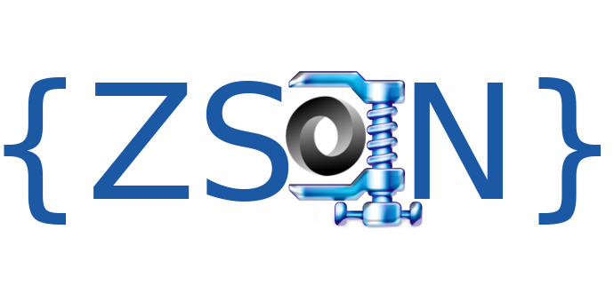

# ZSON



## About

ZSON is a PostgreSQL extension for transparent JSONB compression. Compression is based on a shared dictionary of strings most frequently used in specific JSONB documents (not only keys, but also values, array elements, etc).

In some cases ZSON can save half of your disk space and give you about 10% more TPS. Memory is saved as well. See [docs/benchmark.md](docs/benchmark.md). Everything depends on your data and workload though. Don't believe any benchmarks, re-check everything on your data, configuration, hardware, workload and PostgreSQL version.

ZSON was originally created in 2016 by [Postgres Professional](https://postgrespro.ru/) team: researched and coded by [Aleksander Alekseev](http://eax.me/); ideas, code review, testing, etc by [Alexander Korotkov](http://akorotkov.github.io/) and [Teodor Sigaev](http://www.sigaev.ru/).

See also discussions on [pgsql-general@](https://www.postgresql.org/message-id/flat/20160930185801.38654a1c%40e754), [Hacker News](https://news.ycombinator.com/item?id=12633486) and [Reddit](https://www.reddit.com/r/PostgreSQL/comments/55mr4r/zson_postgresql_extension_for_transparent_jsonb/).

## Install

Build and install ZSON:

```
cd /path/to/zson/source/code
make
sudo make install
```

Run tests:

```
make installcheck
```

Connect to PostgreSQL:

```
psql my_database
```

Enable extension:

```
create extension zson;
```

## Uninstall

Disable extension:

```
drop extension zson;
```

Uninstall ZSON:

```
cd /path/to/zson/source/code
sudo make uninstall
```

## Usage

First ZSON should be *trained* on common data using zson_learn procedure:

```
zson_learn(
    tables_and_columns text[][],
    max_examples int default 10000,
    min_length int default 2,
    max_length int default 128,
    min_count int default 2
)
```

Example:

```
select zson_learn('{{"table1", "row1"}, {"table2", "row2"}}');
```

You can create a temporary table and write some common JSONB documents to it manually or use existing tables. The idea is to provide a subset of real data. Lets say some document *type* is twice as frequent as some other document type. ZSON expects that there will be twice more documents of the first type than of the second in a learning set.

Resulting dictionary could be examined using this query:

```
select * from zson_dict;
```

Now ZSON type could be used as a complete and transparent replacement of JSONB type:

```
zson_test=# create table zson_example(x zson);
CREATE TABLE

zson_test=# insert into zson_example values ('{"aaa": 123}');
INSERT 0 1

zson_test=# select x -> 'aaa' from zson_example;
-[ RECORD 1 ]-
?column? | 123
```

## Migrating to new dictionary

When schema of JSONB documents evolve ZSON could be *re-learned*:

```
select zson_learn('{{"table1", "row1"}, {"table2", "row2"}}');
```

This time *second* dictionary will be created. Dictionaries are cached in memory so it will take about a minute before ZSON realizes that there is a new dictionary. After that old documents will be decompressed using old dictionary and new documents will be compressed and decompressed using new dictionary.

To find out which dictionary is used for given ZSON document use zson_info procedure:

```
zson_test=# select zson_info(x) from test_compress where id = 1;
-[ RECORD 1 ]---------------------------------------------------
zson_info | zson version = 0, dict version = 1, ...

zson_test=# select zson_info(x) from test_compress where id = 2;
-[ RECORD 1 ]---------------------------------------------------
zson_info | zson version = 0, dict version = 0, ...
```

If **all** ZSON documents are migrated to new dictionary the old one could be safely removed:

```
delete from zson_dict where dict_id = 0;
```

In general it's safer to keep old dictionaries just in case. A few KB of disk space don't worth the risk of losing data.

## When it's a time to re-learn?

Unfortunately, it's hard to recommend a general approach.

A good heuristic could be:

```
select pg_table_size('tt') / (select count(*) from tt)
```

... i.e. average document size. When it suddenly starts to grow it's time to re-learn.

However, developers usually know when they change a schema significantly. It's also easy to re-check whether current schema differs a lot from the original using zson_dict table.

